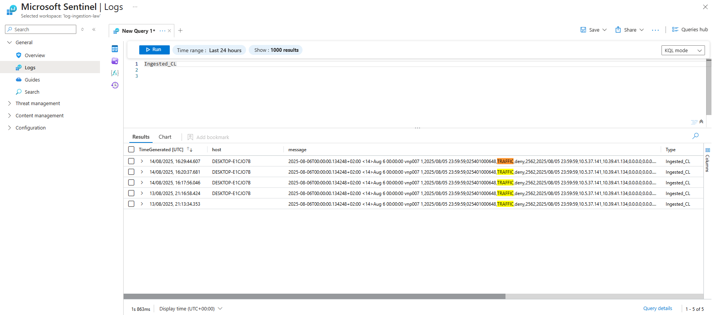

# Log Management System - Homework Assignment

## The Task
The task had 3 parts to it, 1. **Log Reading Tool**, 2. **Syslog Server** nad 3. **SIEM tool.**

### The Log Reading Tool
The Log Reading Tool is a simple bash script that check for the availability of a given host and sends logs to it. Since the sample data had empty lines, the author interpreted it as part of the task and added the ability to send logs with and without those empty lines.

The author initially wanted to create this tool using Python, since they are more familiar with the language and have created plenty of scripts and small applications using it. The idea of creating the application as Bash script posed as an interesting challenge to the author and thus they decided to create the tool using Bash.

Why use the ```logger``` commad? In any other scenario it would've made more sense to setup ```rsyslog``` on the log source machine and have it forward the logs to the **Syslog server**. Since the task required to read the logs and to send those to the **Syslog server** as a standalone tool, then the ```logger``` command's ability to send logs to a remote syslog server instead of to the system log socket became really useful.

More details could be found on [dedicated log tool README](shellTool/README.MD)

### The Syslog Server
The configuration of the Syslog Server and SIEM is done using IaC tools like Ansible and Terraform. Using IaC tools enable to reproduce the desired state of the server in a consistent manner and for the goals of this task enables to showcase the configuration of the Syslog sevrer. 

More details could be found on [Syslog Server README](syslogServer/README.md)

### The SIEM Tool
The SIEM tool chosen for this task is Azure Sentinel as the author already had experience in using it and had experience in configuring it using Terraform.

More details could be found on [SIEM README](SIEM/README.md)

### The Flow
The flow starts off with sending the logs using the **Log Reading Tool**:


Once the logs are sent we can see that they are saved in the correct path format:


And the content of those logs:


And in the end we can see the **TRAFFIC** logs in the SIEM tool:


# Original Task

## Sample Log Data

Below are examples of the logs that will be processed by our system:

```
2025-08-06T00:08:23.934459+02:00 <14>Aug  6 00:08:23 vnp007 1,2025/08/06 00:08:23,025401001338,THREAT,packet,2562,2025/08/06 00:08:23,46.101.228.26,164.10.23.150,0.0.0.0,0.0.0.0,,,,not-applicable,vsys2,external,external,ae2.1805,,default,2025/08/06 00:08:23,0,1,21841,22,0,0,0x2000,tcp,drop,,TCP SYN with data(8723),any,informational,client-to-server,7509250254105075616,0x8000000000000000,Germany,Sweden,,,0,,,0,,,,,,,,0,17,0,0,0,sdn007-fw002,sto03-vnp007,,,,,0,,0,,N/A,N/A,AppThreat-0-0,0x0,0,4294967295,,,,0,,,,,,,,,,,,,,,,,,,,,,,,,,,,,0,2025-08-06T00:08:23.933+02:00,,,0,unknown,unknown,unknown,1,,,not-applicable,no,no,

2025-08-06T00:00:15.193087+02:00 <14>Aug  6 00:00:15 vnp007 1,2025/08/06 00:00:15,025401001338,SYSTEM,general,2562,2025/08/06 00:00:15,,general,,0,0,general,informational,"EDLRefresh job started processing. Dequeue time=2025/08/06 00:00:15. Job Id=5001.   ",7509250254013823345,0x8000000000000000,0,0,0,0,,sto03-vnp007,0,0,2025-08-06T00:00:15.191+02:00

2025-08-06T00:00:30.475278+02:00 <14>Aug  6 00:00:30 vnp007 025401001338,2025/08/06 00:00:30,audit,2562,gui-op,p986_g3m634741,"<set><other-user-changes-commit-permission>yes</other-user-changes-commit-permission></set>",success

2025-08-06T00:00:00.134248+02:00 <14>Aug  6 00:00:00 vnp007 1,2025/08/05 23:59:59,025401000648,TRAFFIC,deny,2562,2025/08/05 23:59:59,10.5.37.141,10.39.41.134,0.0.0.0,0.0.0.0,intrazone-default,,,ssl,vsys1,internal,internal,ae1.1801,ae1.1801,default,2025/08/05 23:59:59,1210333,1,51436,5514,0,0,0x100000,tcp,reset-both,587,521,66,4,2025/08/05 23:59:59,0,any,,7509093300282048706,0x8000000000000000,10.0.0.0-10.255.255.255,10.0.0.0-10.255.255.255,,3,1,policy-deny,112,0,0,0,sdn006-fw003,sto02-vnp006,from-application,,,0,,0,,N/A,0,0,0,0,25aea709-433a-48b6-8817-e80b8d8ac0e8,0,0,,,,,,,,,,,,,,,,,,,,,,,,,,,,,,,,,,,2025-08-06T00:00:00.133+02:00,,,encrypted-tunnel,networking,browser-based,4,"used-by-malware,able-to-transfer-file,has-known-vulnerability,tunnel-other-application,pervasive-use",,ssl,no,no,0
```

## Requirements

Setup a log management system with the following components:

1. **Log Reading Tool:** Create a tool that reads logs from a file and sends them to a syslog server on a custom port.
1. **Syslog Server:** Setup a syslog server that listens on a custom port and performs the following actions when logs arrive:
    - Save each log to `/sb/logs/incoming/$year/$month/$day/$fromhost_ip/syslog.log` where `$year`, `$month`, `$day` are current date values and `$fromhost_ip` is the sender's IP address
    - Analyze log content and forward any logs containing "TRAFFIC" to a SIEM tool
1. **SIEM tool.**

## Evidence Required

Provide documentation with the following evidence:
- Output from the log reading tool showing the reading and forwarding process
- Screenshots or listings of saved log files in the correct directory structure on the syslog server
- Query results from the SIEM tool confirming that only TRAFFIC logs were received
- Explanation of your solution.

Please use own github repository.

