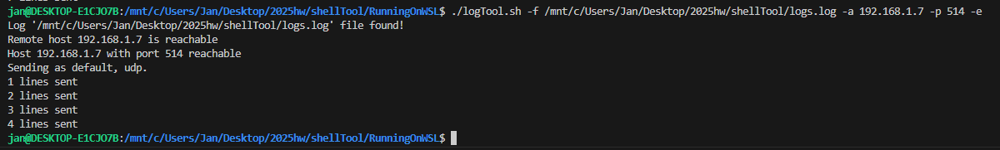

# The Log Reading Tool

## About the tool
The goal of this tool is to read logs from a given file and to send those logs to a host. The tool itself is a simple bash script. The tool is capable of sending logs through *udp* and *tcp*. The tool uses the ```logger``` command to send log messages to a remote host.


## Using the tool

In order to be able to use the tool, the script needs to be given execution rights:
```
chmod +x ./logTool.sh
```

Once the execution rights have been assigned, the programme needs to be used with the **log file** full path, **destination host** and **destination port**. An example looks like the following:
```
./logTool.sh -f /mnt/c/Users/Jan/Desktop/2025hw/shellTool/logs.log -a 192.168.1.7 -p 51400
```


### The options
With the ```-h``` flag (aka the help flag) the page showcasing how to use the tool and it's flags presents itself:
```
jan@DESKTOP-E1CJO7B:/mnt/c/Users/Jan/Desktop/2025hw/shellTool/RunningOnWSL$ ./logTool.sh -h
The script reads lines of logs of a given file, sending those either using tcp or udp with the possibility to exclude log lines just containing newline characters.

Syntax: ./logTool.sh [-a|p|P|e|f|h]
options:
a     The hostname or address of the host where the logs are send, Required.
p     The port of the hostname or address where the logs are send, Required.
P     The protocol being used to send the logs to the host, default: udp.
e     Send the logs without including lines that just contain newlines, default: false.
f     The log file containing logs being sent, Required
h     The help page!

```
### Running on WSL
Due to conflicting EOL when developing the script and running on WSL, the EOL needs to be changed LF from CRLF. Due to the way git behaves, every time it's commited it changes the EOL to CRLF.

## Explanation
The author initially wanted to create this tool using Python, since they are more familiar with the language and have created plenty of scripts and small applications using it. The idea of creating the application as Bash script posed as an interesting challenge to the author and thus they decided to create the tool using Bash.

Why use the ```logger``` commad? In any other scenario it would've made more sense to setup ```rsyslog``` on the log source machine and have it forward the logs to the **Syslog server**. Since the task required to read the logs and to send those to the **Syslog server** as a standalone tool, then the ```logger``` command's ability to send logs to a remote syslog server instead of to the system log socket became really useful.