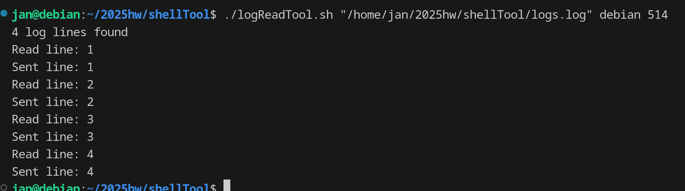

# The Log Reading Tool

## About the tool
The goal of this tool is to read logs from a given file and to send those logs to a host. The tool itself is a simple bash script. At the moment the tool is only capable of sending logs through *udp*. The tool uses the ```logger``` command to send log messages to a remote host.


## Using the tool

In order to be able to use the tool, the script needs to be given execution right:
```
chmod +x ./logReadTool.sh
```

Once the execution right have been assigned, the programme needs to be used with the **log file** full path, **destination host** and **destination port**. An example looks like the following:
```
./logReadTool.sh "/home/jan/2025hw/shellTool/logs.log" debian 514
```


## Explanation
The author initially wanted to create this tool using Python, since they are more familiar with the language and have created plenty of scripts and small applications using it. The idea of creating the application as Bash script posed as an interesting challenge to the author and thus they decided to create the tool using Bash.

Why use the ```logger``` commad? In any other scenario it would've made more sense to setup ```rsyslog``` on the log source machine and have it forward the logs to the **Syslog server**. Since the task required to read the logs and to send those to the **Syslog server** as a standalone tool, then the ```logger``` command's ability to send logs to a remote syslog server instead of to the system log socket became really useful.