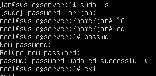
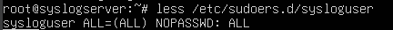

# Syslog Server

## The Server Setup
The server is installed into a Oracle VirtualBox VM, using ```ubuntu-24.04.2-live-server-amd64``` iso image. Thus creating the empty VM which will serve the purpose of the Syslog Server.

### Getting to root
Because this is a fresh install of Ubuntu Server (and I forgot to set the password during installation) the ```root``` user is inaccessible through the ```su``` command. This will not work as further actions require the access to root (and it's inadviseable to have root without a password). To do that I can access the root shell through my user and set the password:



### Spreading the SSH keys
So that further configuration for **Ansible** could take, the config machine (the machine from which **Ansible** playbooks are being run from) the user's public key will be sent over **ssh-copy-id**


### Configuring the user
For the target machine a new dedicated user will be also created with the appropriate groups and accesses:
```
adduser sysloguser
mkdir -p /home/sysloguser/.ssh
chmod 700 /home/sysloguser/.ssh
vim /home/sysloguser/.ssh/authorized_keys
chmod 600 /home/sysloguser/.ssh/authorized_keys
chown -R sysloguser:sysloguser /home/sysloguser/.ssh
```

Will also remove the user's password to make sure that it can't be accessed by anyone other than the root user, for that the **/etc/shadow** file should be edited:


Then the **sysloguser** can be granted sudoers rights, which can be added in the **/etc/sudoers.d/** direcotory, in this example a file sysloguser is added:


## Configuring the machine with ansible

### The packages and dependencies
Since the server will be running the **rsyslog** and **fluent bit** services in containers, the necesarry packages and dependencies must be provisioned. The ```/syslogServer/ansible/playbooks/apt.yaml```. To run the playbook:
```
ansible-playbook ./playbooks/apt.yaml -i ./inventory/hosts.yaml --user sysloguser
```

### Adding syslog user to the docker group
To make sure that the **sysloguser** can use the ```docker-compose```, the user has to be in the **docker** group. For that purpose the  ```/syslogServer/ansible/playbooks/user.yaml``` can be used:
```
ansible-playbook ./playbooks/user.yaml -i ./inventory/hosts.yaml --user sysloguser
```

### Deploying the container to the machine
Once the necessary dependecies are in place and the **sysloguser** is part of the **docker** group the **docker** application can be deployed onto the Syslog Server using the **deploy** tag:
```
ansible-playbook ./playbooks/docker.yaml -i ./inventory/hosts.yaml --user sysloguser --tags deploy
```

Other tag options include:
- **propagate** - Will distirbute all of the configuration files.
- **destroy** - Will stop and delete the current **docker** deployment on the Syslog Server.
- **create** - Will rebuild the **Docker** images and the deploy.


## How to create an image
In order to run the the Rsyslog server container, a local image must be built using the **Dockerfile**.
Either navigate to the folder or provide the path to the **Dockerfile** and use the ```docker build``` command:
```
sudo docker build -t rsyslogserver .
```
This will build the docker image and make it accessable using the **rsyslogserver** tag.

## How to run the Docker image
Once the necessary Docker image had been created, the rsyslog server can be started using the ```docker run``` command:
```
sudo docker run --name rsyslog -d -p 514:514/udp docker.io/library/rsyslogserver
```

This will run a detached container which is named rsyslog using the created Docker image and map both external and internal ip's to 514 using udp.

ansible-playbook ./playbooks/docker.yaml --user syslogserver --ask-become-pass -i ./inventory/hosts.yaml --tags create


ansible-playbook ./playbooks/docker.yaml -i ./inventory/hosts.yaml --user sysloguser  --verbose --tags propagate